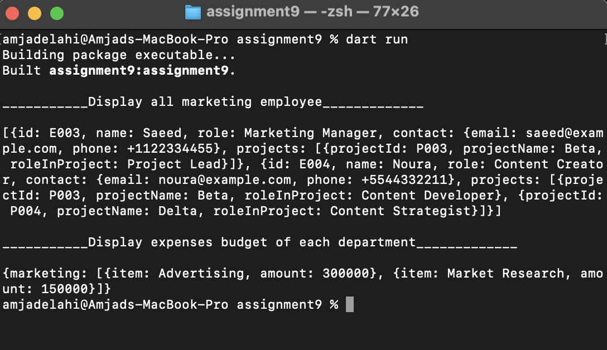

<p align="center">

<br/>

# Assignment 8

## Description

 Working with Json data to display all engineering employees, display all marketing employees, display the projects of each employees, display the expenses of budget of each department, handling null value.

## Requirements

 In order to run the application, this project requires a Dart SDK and a command line interface (CML).

## install dart SDK
 install dart SDK from [dart documentation](https://dart.dev/get-dart)

## How to run the project

1. Open terminal or CMD.
2. Navigate to the project path, such as 
```bash
cd /Users/amjadelahi/dart-bootCamp/Assignment-9/assignment9

```
 3. Run the application with a command: 
```bash
dart run
```
 4. The output of displaying all marketing employee and expenses budget of each department:
      
<p align="center">

<br/>


