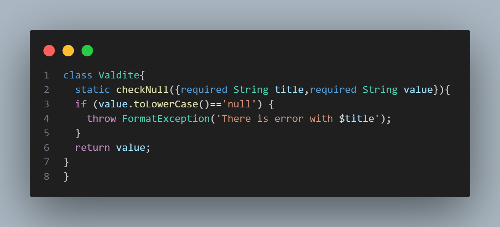
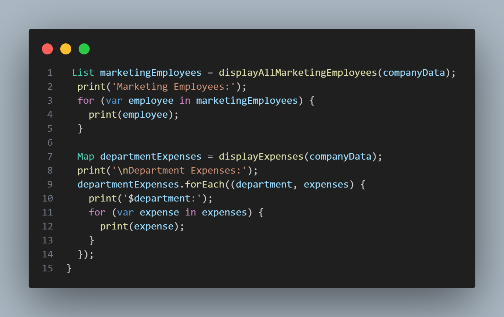

## Project Idea
Dart project for handling a complex `json` data into 10 `classes`
and use `factory` and `toJson` method for display the data

## Main Classes

### Class Data
class `Data` is used for store `json` data

### Class Valdite
contain a function for check `null` value and handle it
by throw it to `FormatException` if it it is `null`

### Class Company
The main class between the 10 classes for handling
`json` data

## main
contain tow method `displayAllMarketingEmployees` &
`displayExpenses` for display marketing employee
and department expense

fell free to use 

by `Basel-75` Github