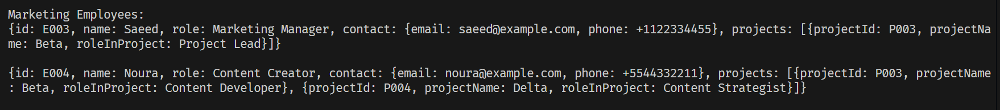
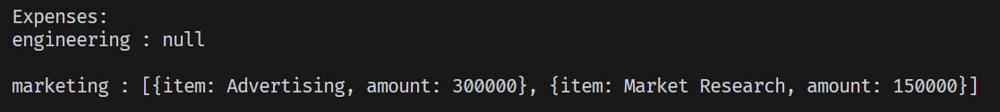

# Comppany Information System

A simple console-based application for storing and displaying company-related data, including employee details, project information, and departmental budgets.

## Description

The Company Information System is designed to facilitate the management and display of various aspects of a company's data. The key features include:
- Display employees
- Display expenses and budget for each department
- Check for null values

The application is built in Dart

## Getting Started

### Dependencies

Before running the program, ensure you have the following prerequisites:

- Dart SDK installed
- Compatible with any operating system that supports Dart (Windows, macOS, Linux)

### Installing

1. Clone the repository to your local machine:
```bash
git clone https://github.com/Abdulaziz-Alamri/assignment-9.git
```

2. Navigate to the project directory:
```bash
cd assinment-9
```
3. Install the required Dart packages:
```bash
dart pub get
```
### Executing Program

To run the program, use the following command:
```bash
dart run
```

### Step-by-Step Usage

**Display All Marketing Employees**
- Invoke the function to print all marketing employees' information in JSON format.



**Display Department Expenses**
- Execute the function to view the budget and expenses for each department (Engineering and Marketing).



## Help
If you encounter any issues:
- Ensure you have properly formatted JSON data for processing.
- Check the `FormatException` messages for missing or invalid data entries.

## Authors
Abdulaziz Alamri

## Version History
**See commits history for more details**

## Acknowledgments
Tuwaiq Academy

