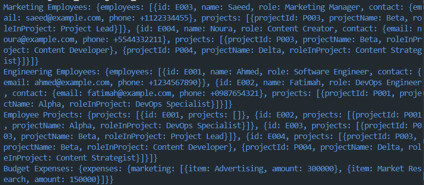

# User Service System in Dart

## Description
An in-depth system for managing user data with basic functionalities such as displaying users, retrieving users by their first name or email, and viewing user children. This project demonstrates how to handle user data in Dart, providing a clear structure for managing user information and interactions.

## Getting Started

### Dependencies
- Dart SDK

### Installing
1. **Clone the repository:**
   ```bash
   git clone https://github.com/imahacs/Assignment-9
   ```
2. **Clone the repository:**
    ```bash
    cd assignment_9
     ```
3. **Install the required dependencies:**
    ```bash
    dart pub get
    ```
4. **Ensure that you have the Dart SDK installed.** If not, download and install it from the Dart's official website.

## Executing Program
To run the program, use the following command:

    dart run

## Help
For common issues or troubleshooting:

- Ensure all dependencies are correctly installed.
- Verify that your Dart SDK is up to date.
- Review the code and verify that JSON data structures match expected formats.
For additional help, consult the Dart documentation or open an issue on the project's GitHub repository.

### Example Usage



## Authors
- imahacs - [GitHub Profile](https://github.com/imahacs)

## Version History
- 0.1 - Initial Release

## License
This project is licensed under the MIT License - see the [LICENSE](LICENSE.md) file for details.
.

## Acknowledgments
- Inspired by various Dart and JSON handling tutorials.
- Thanks to the open-source community for their contributions and support.