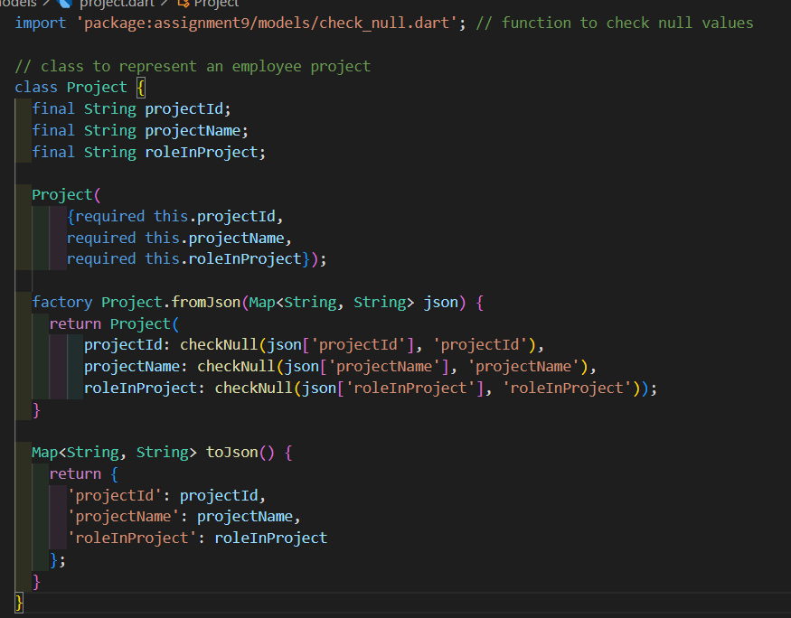

# Assignment 9 : Company Data

# 1. Overview 📖
This assignment focuses on bulilding classes "models" based on some 'json' data, we will discuss the classes created and its purpose

# 2. Code and Implementation 💻
In this section, we will discuss the classes and functions.

## 2.1 Classes
In this section we will discuss classes built in the assignment, all classes have been through the same process which includes creating **factory** constructor and **toJson** method.

### 2.1.1 `Company` class
This class is created to represent the company itself, it has two attributes which are
- `Department` departments
- `CompanyProjects` projects

### 2.1.2 `Department` class
It represents a department in the company, it contains two attributes :
- `Engineering` engineering
- `Marketing` marketing

### 2.1.3 `Engineering` & `Marketing` classes
They both represent the engineering and marketing departments in a company, each one has two attributes :
- `List<Employee>` employees
- `Budget?` budget

### 2.1.4 `Employee` class
This class represents an employee in the company, it has the following attributes :
- `String` id
- `String` name
- `String` role
- `Contact` contact
- `List<Project>?` projects

### 2.1.5 `Contact` class
This class contains an employee contact info, it has two attributes :
- `String` email
- `String` phone

### 2.1.6 `Project` class
This indicates the projects associated with an employee, it has 3 attributes :
- `String` projectId
- `String` projectName
- `String` roleInProject

### 2.1.7 `Budget` class
Represents the budget of a department in the company, it has 2 attributes :
- `int` total
- `List<Expense>` expenses

### 2.1.8 `Expense` class
Represents expenses of a certain budget, it has 2 attributes :
- `String` item
- `int` amount

### 2.1.9 `CompanyProjects` class
This class represents all the company projects and it has 4 attributes
- `ProjectA` projectA;
- `ProjectB` projectB;
- `ProjectC` projectC;
- `ProjectD` projectD;

Each of the four attributes is a class containing the following attributes :
- `String` id
- `String` name
- `String` deadline
- `List<Team>` teams

### 2.1.10 `Team` class
Team class represents a team in a project and has the following attributes :
- `String` employeeID
- `String` role

## 2.2 Functions
Functions built in the assignment summerizes as follows :
- `getMarketingEmployees` : get marketing employees
- `expensesByDepartment` : get expenses by department
- `checkNull` : check null values

# 3. Conclusion 🏁
This assignment is a very useful way to practice on reading json files and build classes out of it.