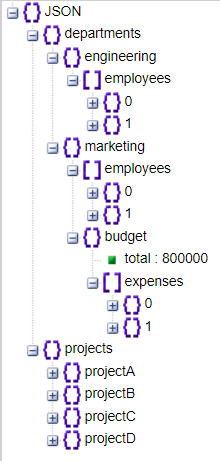

# Assignment 8

This is a console application built with dart. This project demonstrates basic operations on a user dataset, including fetching all users, finding users by their first name, and finding users by their email address.  

## Installation

1. Ensure you have Dart installed on your system. If not, you can download it from [Dart's official website](https://dart.dev/get-dart).
2. Clone this repository:
    ```bash
    git clone https://github.com/turki-aloufi/Assignment-9.git
    ```
3. Navigate to the project directory:
    ```bash
    cd Assignment-9
    ```

## Usage

1. Run the application:
    ```bash
    dart run
    ```
## Data set

- We are dealing with a json data inside the file `bin/data_set.dart`.

## Models

- the tree below shows the models have been created.

  

## Error handling

- a function `validateJson()` that takes a json file and checks if there the value of 'department' or 'projects' is null, if it was null the function will throw an exception. 

